<div align="center">

# Forge

**The open-source, self-hosted platform for visually building, testing, and shipping AI agents & workflows.**

Wire agents, tools, knowledge, and logic on a canvas - ground them in your data, connect them to your systems, and deploy to email, an API, an MCP server, or an embeddable web widget. No framework code required.

[](LICENSE)
[](apps/api/pyproject.toml)
[](apps/web/package.json)
[](apps/api)
[](apps/web)
[](https://github.com/langchain-ai/langchain)
[](#contributing)

</div>

---

Forge is built directly on the **MIT-licensed LangChain v1 + LangGraph v1** framework - and **never** depends on `langgraph-api` (Elastic 2.0) or LangSmith (commercial). Everything you orchestrate runs on your own infrastructure; nothing is sent to a third-party orchestration service.

- **Fully open source (MIT).** No proprietary core, no usage caps, no vendor lock-in.
- **Zero-infra local dev.** Boots on SQLite + embedded Chroma + an in-process scheduler - no Docker, Postgres, or Redis required to start.
- **Production-ready.** Swap to Postgres + pgvector, Redis, and a real secret store with config only - a hardening guard refuses to boot with insecure defaults.
- **Observable by default.** Every run is a span waterfall with tokens, latency, and cost down to fractions of a cent.

## Table of contents

- [Features](#features)
- [Architecture](#architecture)
- [Quick start](#quick-start-local-zero-infra)
- [Run with Docker](#run-with-docker-production-shaped)
- [Documentation](#documentation)
- [Tech stack](#tech-stack)
- [Contributing](#contributing)
- [License](#license)

## Features

<div align="center">
  <video src="https://github.com/user-attachments/assets/798a6872-0a47-455f-81be-4566184e3e9c" controls muted width="85%"></video>
</div>

> **[Watch the demo](docs/media/Forge_demo.mp4)** - the in-product **Forge Assistant** builds and runs a workflow end to end. *(If the player doesn't load inline, click the link to play.)*

### Visual Workflow Builder

Wire an entire app on a **drag-and-drop canvas** (React Flow): drop nodes from the palette - **agents** & deep agents, model calls, classifiers, tools, transforms, retrieval, human input/handoff, routers, loops, parallel fan-out/join, subworkflows, and triggers - and connect them with **typed, validated** edges. A per-node inspector and a live **state schema** keep runs type-safe, while a minimap, undo/redo, and copy/paste keep big graphs manageable. **Save**, **Test**, or open the **Playground** to watch nodes light up as the run streams - then **Publish**.

<p align="center">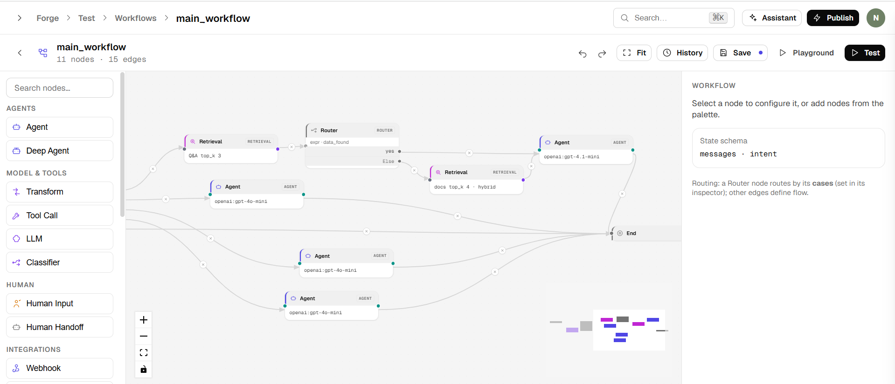</p>

### Visual Agent Builder

Compose an **Agent** or a **Deep Agent** (planning + subagents for long multi-step tasks) from a model, a system prompt, tools, knowledge, Q&A, and a reorderable **middleware stack** - all from friendly forms, no JSON. A live *"what the model sees"* panel shows the exact compiled prompt and middleware execution order before you ship.

<p align="center">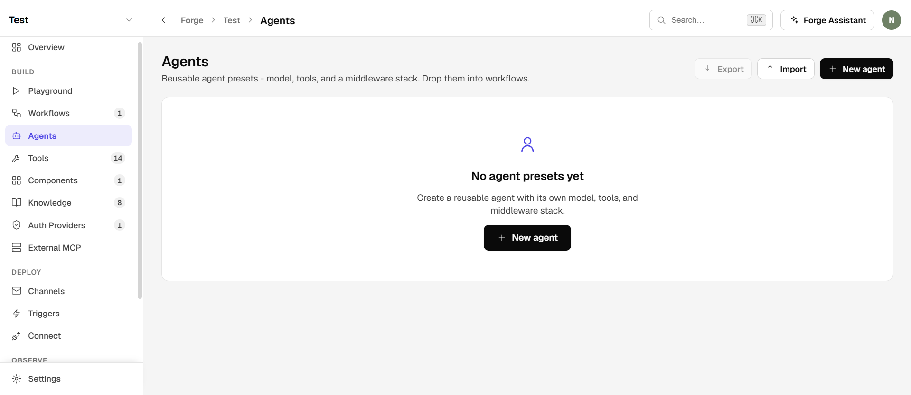</p>

### Tool Builder with Response Projection

Register **REST, GraphQL, Code, SQL, MCP, or built-in** tools and test them live against real inputs. A **JMESPath response projection** trims bulky payloads *before* they reach the model - watch the raw → projected **token meter** shrink in real time to control cost. Every outbound call is screened by an **SSRF guard**, with optional retries, rate limits, and caching. Organize tools into **tool sets** - reusable, many-to-many groups that double as folders on the screen, get granted to an agent in one click, and publish as MCP toolsets.

<p align="center">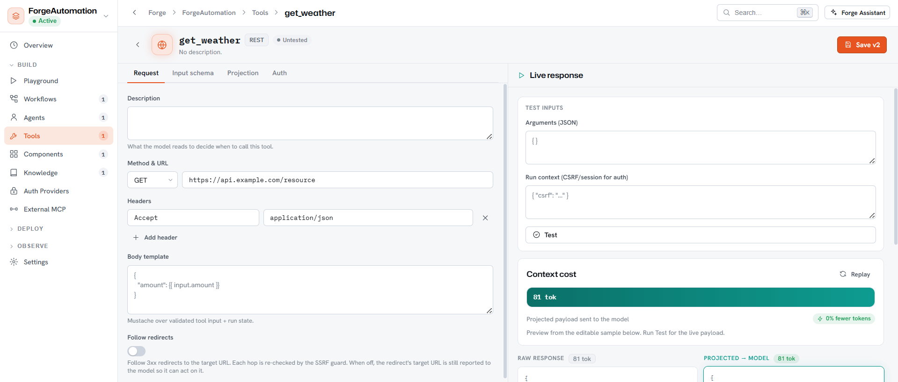</p>

The Tools screen groups everything by set (switchable between grid and list), with one-click **export / import** to move tools between projects:

<p align="center">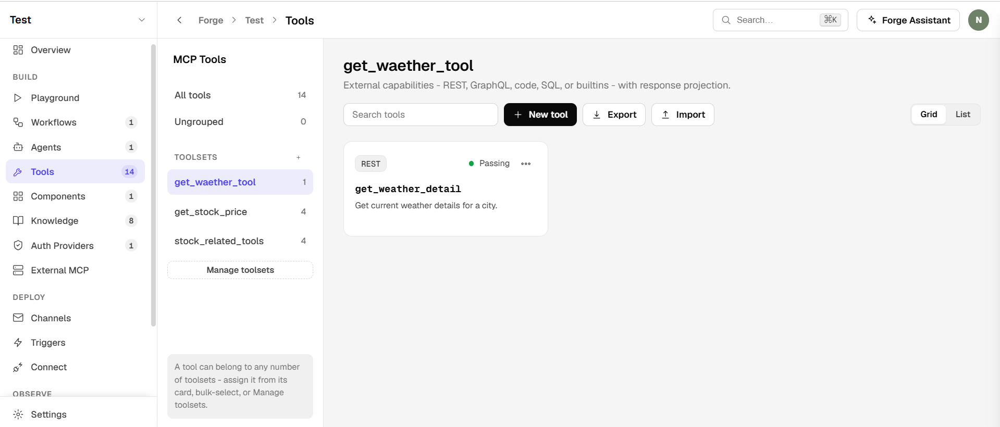</p>

### Knowledge & RAG

Ground agents in **your own data**. Add pasted text, URLs, crawled sites, or uploaded files (`.txt/.md/.csv/.json/.html/.pdf`); Forge chunks, embeds (**offline-capable by default**), and stores them as vectors organized in folders. Curated **Q&A pairs** deflect common questions, and a **search debugger** lets you inspect exactly what retrieval returns.

<p align="center">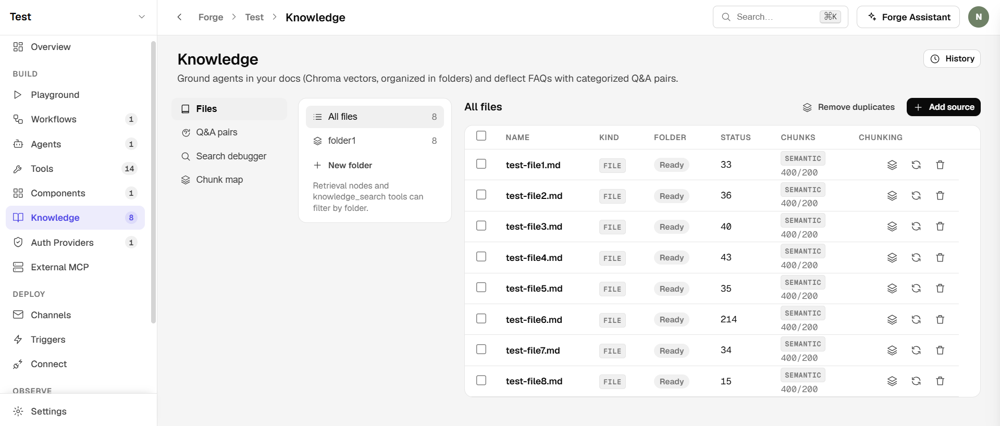</p>

The built-in **search debugger** plots every chunk by semantic similarity and overlays a query - so you can see exactly which chunks a search retrieves, and why:

<p align="center">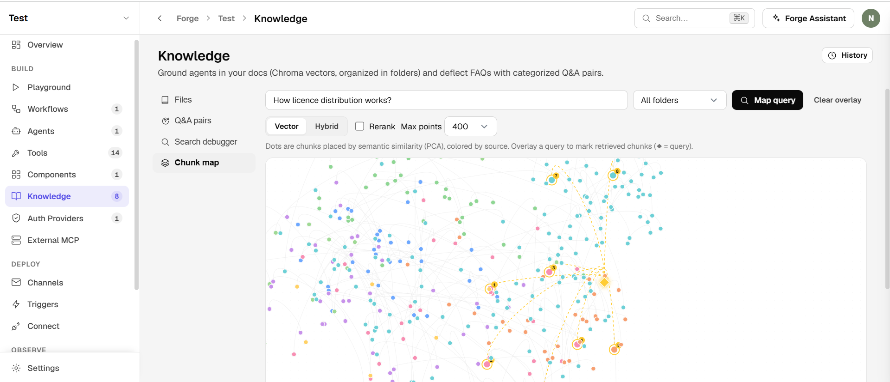</p>

### Generative UI Components

Let agents render **rich, interactive UI** - tables, cards, forms - instead of plain text. Author an HTML/CSS component once with a live preview; the model emits a tiny payload while the markup renders in a **sandboxed iframe** and never bloats the token stream. Buttons can send structured actions straight back to the agent.

<p align="center">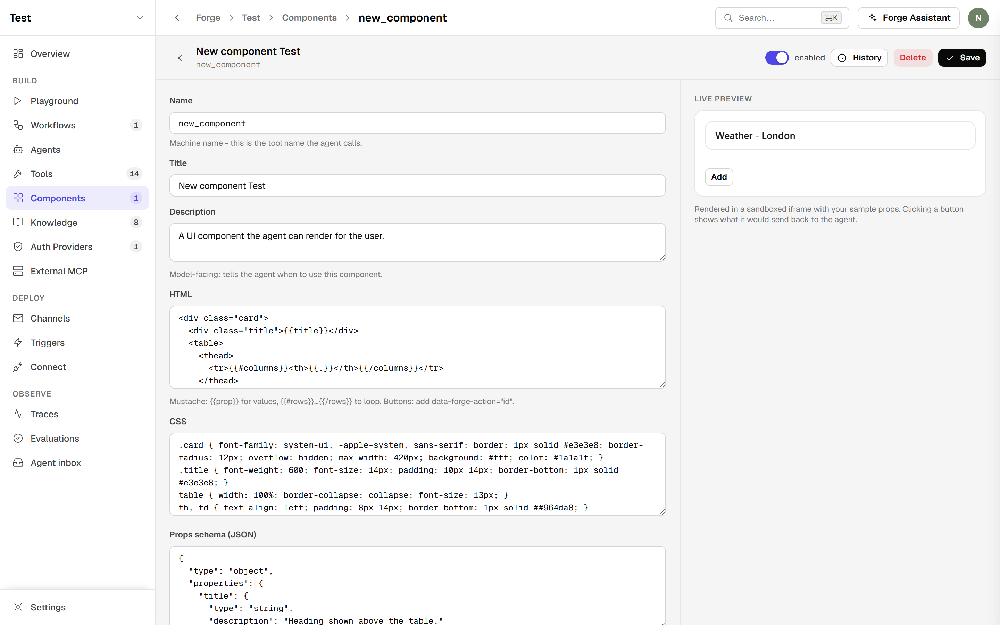</p>

### Embeddable Web Widget

Drop your assistant onto **any website** with a one-line script - a floating chat bubble locked to the origins you allow. End users see only the conversation; operational details (steps, tokens, cost, node names) stay private in the dashboard.

<p align="center">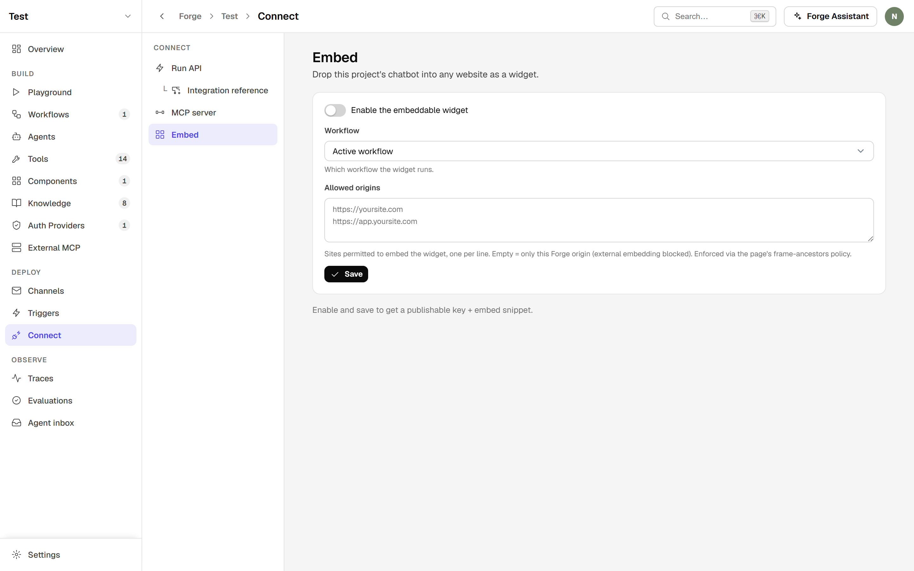</p>

### Deploy anywhere - one run API, MCP & channels

Ship the same workflow through many surfaces without rewriting it: call it server-to-server over a **single run API** (`POST /run` handles new turns, streaming, and human-in-the-loop resumes), expose it as an **MCP server**, deploy it to **email**, or drop in the **web widget**. Per-request caller context (`X-Forge-Context`) lets tools act on behalf of your end users - with secrets never in the request body.

<p align="center">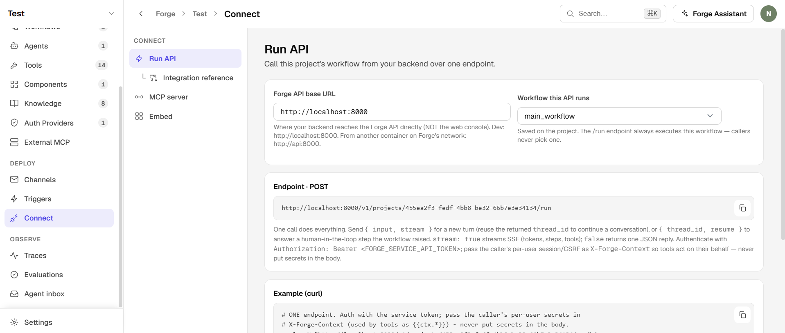</p>

### Observability & Traces

Every run is captured as a **span waterfall** - model calls, tools, chains, latency, tokens, and **cost** - so you can see exactly what happened and what it cost. Pair it with **Evaluations** to catch regressions before you publish, and export traces to any **OpenTelemetry** collector (e.g. Langfuse).

<p align="center">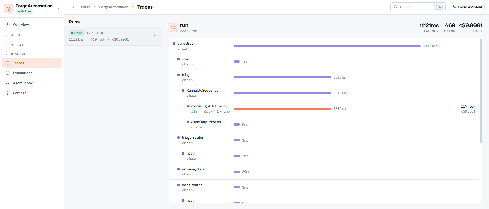</p>

### Guardrails, budgets & governance

Run it like production. A project-level **Guardrails & Egress** policy (PII redaction, blocked terms, and a network allow/deny list) applies to every agent by default; **budgets & quotas** cap spend and tokens; **versioning** snapshots every change; and it all sits behind per-project **roles / RBAC** and an audit log - from one Settings surface.

<p align="center">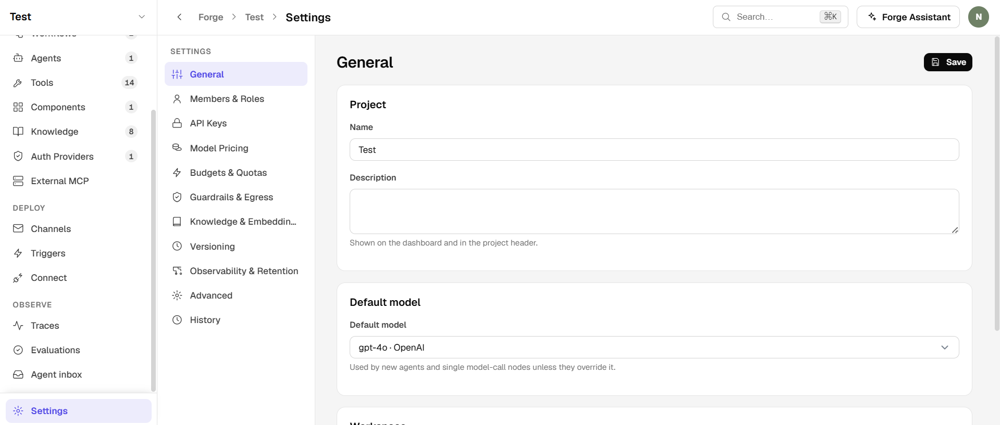</p>

### And many more

- **Channels** - deploy a workflow to **Email**.
- **Triggers** - webhooks, schedules (interval/cron), inbound email, and polling "app events".
- **Human-in-the-loop** - approve/reject pauses and live **handoff** to an Agent inbox, with the reply delivered back over the same channel.
- **Auth Providers** - Bearer, API key, Basic, OAuth2 (client-credentials **and** 3-legged user login with auto-refresh), and CSRF/session - backed by encrypted, reference-only secrets (`secret://…`).
- **MCP, both ways** - expose your tools as an **MCP server** over native Streamable-HTTP/SSE (Claude Desktop, Cursor, and VS Code connect directly - no bridge), authenticated by a project key, per-user **personal access tokens**, or optional **OAuth 2.1**, publishing tool sets, knowledge, Q&A, or a whole workflow; and consume tools from external MCP servers.
- **Guardrails & egress policy** - one project-level I/O policy (PII redaction, blocked terms, and a network allow/deny list) enforced on every agent by default; a project can only *tighten* it, never loosen it.
- **Import & export** - move tools, workflows, agents, and components between projects as portable JSON bundles (secret *values* never leave).
- **Evaluations** - datasets scored by `contains` / `exact` / `regex` / LLM-`judge` for a pass rate per workflow.
- **Long-term memory**, response caching, retries with backoff, and per-tenant **budgets**.
- **Multi-tenant projects & roles** (owner/admin/editor/viewer/connector) with **per-project RBAC**, scoped revocable API keys, entity **version history**, and an **audit log**.
- **Provider-agnostic models** - OpenAI, Anthropic, Google, or any LangChain provider, plus an offline `fake:` model so you can build the plumbing without spending a cent.

> See the full **[User Manual](docs/MANUAL.md)** for an end-to-end tour and worked examples.

## Architecture

A pnpm + Python monorepo with a shared schema contract that keeps the backend and frontend in lockstep:

```
forge/
├── apps/
│   ├── api/        FastAPI backend - the engine (compiler, registry, middleware), tools,
│   │              auth, knowledge, tracing, MCP server, build assistant. Dockerfile +
│   │              Alembic migrations live here.   [Python]
│   └── web/        Next.js console - canvas, config panels, playground, traces. Dockerfile
│                  lives here.   [TS/React]
├── packages/
│   └── schemas/    Shared JSON Schemas - the single source of truth, imported by the
│                  backend validator/compiler AND the frontend <SchemaForm>.
├── docs/           User manual, roadmap, and media.
├── infra/          Production database swaps (Postgres row-level-security policies).
└── docker-compose.yml   Production-shaped stack (Postgres · Redis · api · worker · web).
```

The **shared schemas** are the contract behind three consumers: the backend **validator** (rejects bad configs on save), the **compiler** (`compile_workflow`, `build_middleware`), and the frontend **`<SchemaForm>`** (forms generated from the same files).

## Quick start (local, zero-infra)

### Prerequisites

- **Python** 3.11–3.13 - the backend engine
- **Node** 22 LTS and **pnpm** 9+ - the web console
- Nothing else - the local stack runs on SQLite + embedded Chroma + an in-process scheduler, so **no Docker, Postgres, or Redis** is required to start.

### 1. Configure environment

```bash
cp .env.example .env        # macOS/Linux
copy .env.example .env      # Windows
```

Open `.env` and fill in what you need (e.g. an LLM provider key). Everything is optional to boot; agents that call a model need a provider key. **Never commit your `.env`** - it is already git-ignored.

### 2. Backend (FastAPI engine)

```bash
cd apps/api
python -m venv .venv && source .venv/bin/activate     # .venv\Scripts\activate on Windows
pip install -e ".[dev,all]"                            # engine + tests + vectors/providers/knowledge/MCP
pytest                                                 # optional: validate the engine (offline)
uvicorn forge.main:app --reload --port 8000            # http://localhost:8000/docs
```

### 3. Frontend (Next.js console)

In a second terminal, from the repo root:

```bash
pnpm install
pnpm --filter web dev                                  # http://localhost:3000
```

Open **http://localhost:3000** for the console and **http://localhost:8000/docs** for the API. On first run, sign in with `you@forge.local` / `forge-admin`, or create a fresh workspace.

## Run with Docker (production-shaped)

The included [`docker-compose.yml`](docker-compose.yml) brings up a production-shaped stack - **Postgres** (app DB + durable checkpointer), **Redis** (shared rate-limit/idempotency + worker queue), the **API**, a **worker**, and the **web** console:

```bash
# Set real secrets first (FORGE_JWT_SECRET, FORGE_BOOTSTRAP_ADMIN_PASSWORD, provider keys)
docker compose up --build
```

With `FORGE_ENVIRONMENT=production`, Forge enables a hardening guard and **refuses to boot** with default secrets, SQLite, or a non-durable checkpointer. See [`apps/api/README.md`](apps/api/README.md) and **[Manual §13 - Going to production](docs/MANUAL.md)** for the full, annotated configuration.

## Documentation

| Doc | What's inside |
|---|---|
| **[User Manual](docs/MANUAL.md)** | Full feature tour, the node catalog, and end-to-end use cases (no developer knowledge needed). |
| **[Backend README](apps/api/README.md)** | API layout, local-vs-production swaps, and dependency notes. |
| **[Tech stack & architecture](TECH_STACK.md)** | Every dependency and why it's there, plus request/run sequence diagrams. |
| **[Roadmap & status](docs/ROADMAP.md)** | What's shipped, what's in progress, and what's planned next (connectors, more channels, and more). |
| **[Changelog](CHANGELOG.md)** | Notable changes, following Keep a Changelog + SemVer. |
| **[Contributing](CONTRIBUTING.md)** | Local setup, the checks CI runs, and commit/PR conventions. |

## Tech stack

| Layer | Technology |
|---|---|
| **Engine** | LangChain v1 · LangGraph v1 · Deep Agents - MIT framework only |
| **Backend** | Python · FastAPI · SQLAlchemy 2 (async) · Pydantic v2 |
| **Frontend** | Next.js 14 (App Router) · React 18 · TypeScript · React Flow |
| **Data (local)** | SQLite · embedded Chroma · in-process cache/scheduler |
| **Data (prod)** | Postgres 16 + pgvector · Redis 7 · Fernet/Vault secrets |
| **Observability** | Built-in tracer + cost accounting · OpenTelemetry / Langfuse export |

## Contributing

Contributions are welcome. Forge is MIT-licensed and built to be extended.

1. Fork the repo and create a feature branch.
2. Backend changes: run `pytest` and `ruff check forge migrations` from `apps/api`.
3. Keep the **shared schemas** (`packages/schemas`) authoritative - the validator, compiler, and frontend forms all read from them.
4. Open a pull request describing the change and the reasoning.

Found a bug or have an idea? Please [open an issue](https://github.com/nihalashetty/Forge/issues).

## License

Forge is released under the **[MIT License](LICENSE)** - free to use, modify, and distribute, including commercially. It builds only on the MIT-licensed LangChain/LangGraph ecosystem, with no Elastic-2.0 or commercial-license dependencies.

<div align="center">
<sub>Built on the open-source LangChain and LangGraph ecosystem.</sub>
</div>
