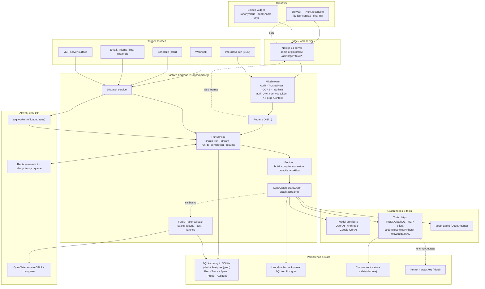
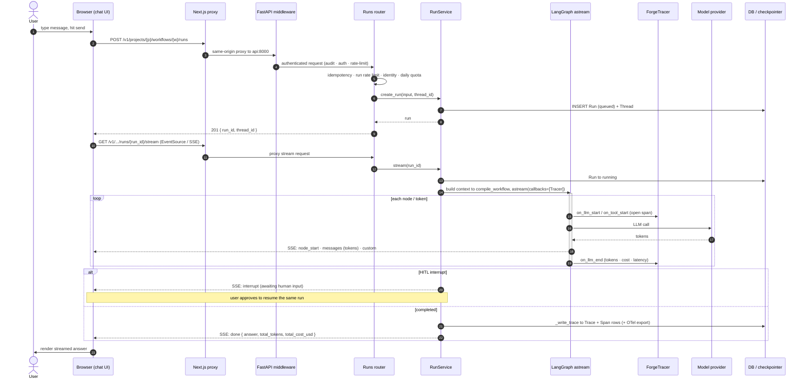

# Forge — Technology Stack

Every technology used in Forge, its purpose, and where it lives. Sourced from `apps/web/package.json`, `apps/api/pyproject.toml`, both `Dockerfile`s, `docker-compose.yml`, and `apps/api/forge/config.py`. Backend deps grouped `[in brackets]` are **optional extras** (installed on demand / prod); everything else is core.

| Layer | Technology | Use case | Where it lies |
|---|---|---|---|
| **Frontend** | Next.js 14.2 | React framework; standalone server + build-time API proxy rewrites to the backend | `apps/web` (web console); `next.config.mjs` |
| **Frontend** | React 18.3 + React DOM | UI component rendering | `apps/web` |
| **Frontend** | TypeScript 5.6 | Typed frontend language | `apps/web` (`tsconfig.json`) |
| **Frontend** | @xyflow/react (React Flow) 12 | Visual drag-and-drop node-graph editor — the workflow builder canvas | `apps/web` (builder/canvas components) |
| **Frontend** | react-markdown 9 + remark-gfm 4 | Render agent/chat responses as GitHub-flavored Markdown | `apps/web` (chat UI) |
| **Frontend** | mustache 4 | Client-side `{{...}}` template rendering | `apps/web` |
| **Frontend** | jmespath 0.16 | JSON projection/query in the browser | `apps/web` |
| **Frontend / Build** | Node.js 22 | JS runtime for building and serving the console | `apps/web/Dockerfile` (`node:22-alpine`) |
| **Build / Monorepo** | pnpm (workspace) | Package manager + monorepo workspaces (`apps/web`, `packages/*`) | repo root (`pnpm-workspace.yaml`, `corepack`) |
| **Backend / API** | Python 3.11–3.13 | Backend language (runtime image: `python:3.12-slim`) | `apps/api` |
| **Backend / API** | FastAPI 0.115 | HTTP/REST API framework, routing, dependency injection, middleware | `apps/api/forge/main.py`, `forge/routers/*` |
| **Backend / API** | Uvicorn[standard] 0.32 | ASGI server that runs the app | serve command (`uvicorn forge.main:app`) |
| **Backend / API** | sse-starlette 2.1 | Server-Sent Events streaming of run event frames (`run`/`node_start`/`messages`/`done`) | `forge/routers/runs.py` |
| **Backend / API** | python-multipart | Multipart form / file upload parsing | `apps/api` |
| **Backend / API** | hatchling | Python package build backend | `apps/api/pyproject.toml` |
| **Config / Data** | Pydantic 2.9 | Request/response DTOs, data validation | `forge/schemas/dto.py`, models |
| **Config / Data** | pydantic-settings 2.6 | Environment-driven application settings | `forge/config.py` |
| **Config / Data** | email-validator 2.2 | Validate email fields (invites, auth) | `apps/api` |
| **Agent / Engine** | LangChain 1.3 + langchain-core | LLM orchestration primitives (messages, tools, model bindings) | `forge/engine/*` |
| **Agent / Engine** | LangGraph 1.2 | Stateful agent/workflow graph engine — compiles nodes into a runnable graph; the execution core | `forge/engine/compiler.py`, `forge/services/runs.py` |
| **Agent / Engine** | langgraph-checkpoint 4 | Checkpointer interface for durable / resumable run + HITL state | `forge/engine`, `forge/services/runs.py` |
| **Agent / Engine** | langgraph-checkpoint-sqlite 3 | SQLite-backed checkpointer (dev default) | `.data/checkpoints.sqlite` |
| **Agent / Engine** | deepagents 0.6 | Deep Agents harness (planning, subagents, virtual filesystem, sandbox) — always-registered `deep_agent` node | agent node palette |
| **Model Providers** | langchain-openai 1.x | OpenAI model access | `[providers]` extra |
| **Model Providers** | langchain-anthropic 1.x | Anthropic Claude models + prompt-caching middleware | `[providers]` extra; `default_anthropic_prompt_caching` |
| **Model Providers** | langchain-google-genai 4.2+ | Google Gemini models | `[providers]` extra |
| **Model Providers** | tiktoken 0.7 | Accurate token counting for the cost meter / budgets (falls back to len/4) | `forge/tracing/pricing.py` |
| **Tooling Primitives** | httpx 0.27 | Outbound HTTP for REST/GraphQL tools, webhooks, `web_fetch`, OAuth/token fetches | tool runtime + egress/SSRF guard |
| **Tooling Primitives** | jsonschema 4.23 | Validate node/tool config against the shared JSON Schemas | `packages/schemas` + engine |
| **Tooling Primitives** | jmespath 1.0 (py) | JSON projection of tool outputs | tool runtime |
| **Tooling Primitives** | RestrictedPython 7.4 | AST-sandboxed execution of code tools (opt-in; hardening layer, not OS isolation) | code tool runtime (`enable_code_tools`) |
| **MCP** | langchain-mcp-adapters 0.2 | Consume external MCP servers as tools | `[mcp]` extra |
| **MCP** | mcp 1.9 | Model Context Protocol SDK | `[mcp]` extra |
| **MCP** | fastmcp 3 | Expose Forge projects as MCP servers | `[mcp]` extra |
| **Knowledge / RAG** | chromadb 1.5 | Embedded persistent vector store (zero infra) | `[vectors]` extra; `.data/chroma` |
| **Knowledge / RAG** | fastembed 0.3+ | **Default embedder** — local open-source ONNX model (no API cost / no PyTorch); also powers the local cross-encoder **reranker** (`TextCrossEncoder`) | `[knowledge]` extra |
| **Knowledge / RAG** | langchain-text-splitters 1.x | Chunk/split documents for ingestion | `[knowledge]` extra |
| **Knowledge / RAG** | pypdf 5 | Extract text from PDF documents | `[knowledge]` extra |
| **Knowledge / RAG** | beautifulsoup4 4.12 | Parse HTML for URL ingestion | `[knowledge]` extra |
| **Knowledge / RAG** | rank-bm25 0.2 | Lexical (BM25) ranking for hybrid vector + keyword search | `[knowledge]` extra |
| **Persistence** | SQLAlchemy 2.0 [asyncio] | Async ORM / database access layer | `forge/models/entities.py` |
| **Persistence** | aiosqlite 0.20 | Async SQLite driver (dev default) | dev DB `.data/forge.db` |
| **Persistence** | Alembic 1.14 | Schema migrations (controlled prod path) | `apps/api/migrations`, `alembic.ini` |
| **Persistence** | greenlet 3.1 | Async/sync bridge required by SQLAlchemy asyncio | runtime dependency |
| **Persistence** | SQLite | Default dev database + checkpointer store | `.data/*.db` (dev only) |
| **Persistence** | PostgreSQL 16 | Production application database + shared durable checkpointer | `docker-compose.yml` (prod) |
| **Persistence** | asyncpg 0.30 / psycopg[binary,pool] 3.2 | Async Postgres drivers | `[postgres]` extra (prod) |
| **Persistence** | langgraph-checkpoint-postgres 2.x | Durable Postgres checkpointer shared across workers (prod/HITL) | `[postgres]` extra (prod) |
| **Secrets / Auth** | cryptography 43 (Fernet) | Encrypt stored secrets/credentials with a master key | `.data/master.key`; secrets service |
| **Secrets / Auth** | python-jose[cryptography] 3.3 | Mint/verify platform JWT access + refresh tokens (with `kid` rotation) | auth layer (`forge/config.py` JWT settings) |
| **Secrets / Auth** | bcrypt 4 | Password hashing for local accounts | auth layer |
| **Background / Workers** | Redis 7 | Shared rate-limit / idempotency store + worker queue backend | `docker-compose.yml` (prod); `[workers]` extra |
| **Background / Workers** | arq 0.26 | Async task queue + worker for offloaded run execution | `forge/worker.py`, `forge/queue.py`; `[workers]` |
| **Background / Workers** | croniter 2–5 | Evaluate cron `schedule` triggers | scheduler; `[workers]` |
| **Observability** | opentelemetry-sdk 1.20 | Emit run traces/spans (GenAI semantic conventions) | `forge/tracing/otel.py`; `[observability]` |
| **Observability** | opentelemetry-exporter-otlp-proto-http 1.20 | Export spans to an OTLP collector / Langfuse | `forge/tracing/otel.py`; `[observability]` (opt-in via `otel_enabled`) |
| **Infra / Deploy** | Docker + Docker Compose | Production-shaped container stack (postgres + redis + api + worker + web) | repo root (`docker-compose.yml`, `apps/*/Dockerfile`) |
| **Dev Tooling** | pytest 8.3 + pytest-asyncio 0.24 | Test suite (async mode auto) | `apps/api/tests`; `[dev]` extra |
| **Dev Tooling** | anyio 4.6 | Async test/runtime utilities | `[dev]` extra |
| **Dev Tooling** | ruff 0.8 | Linting + import sorting/formatting | `pyproject.toml [tool.ruff]`; `[dev]` extra |

**Notes**
- **Local dev needs no external infra**: SQLite + embedded Chroma + in-process (fake) cache/queue. The prod swaps — Postgres, Redis, OTLP, Vault/KMS — are configuration-only (no code changes).
- **Framework is MIT-only**: LangChain/LangGraph OSS packages; deliberately **not** `langgraph-api` or LangSmith.
- **Optional extras** map to `pip install -e ".[...]"` groups in `pyproject.toml`: `providers`, `vectors`, `knowledge`, `mcp`, `workers`, `postgres`, `observability`, `dev` (and `all` = vectors+providers+knowledge+mcp).

---

## Architecture

How the pieces above fit together. The browser talks to a **same-origin** Next.js proxy (`/api/forge/*`) that rewrites to the FastAPI backend; every run — whatever triggers it — funnels through one `RunService`, and one `ForgeTracer` observes it.

---

## Example flow — a user sends a chat message

The interactive path (console or embed widget). Sending a message is **two HTTP calls**: a `POST` that creates the run row, then a `GET` that opens the SSE stream carrying tokens and lifecycle events back to the browser.

> **Non-interactive triggers** (webhook / schedule / email / Teams) skip the browser and the SSE stream: they enter through the **Dispatch service** and call `RunService.run_to_completion()` instead of `stream()` — but the compile → LangGraph → ForgeTracer → Trace/Span path is identical, which is what keeps observability consistent across every entry point.
